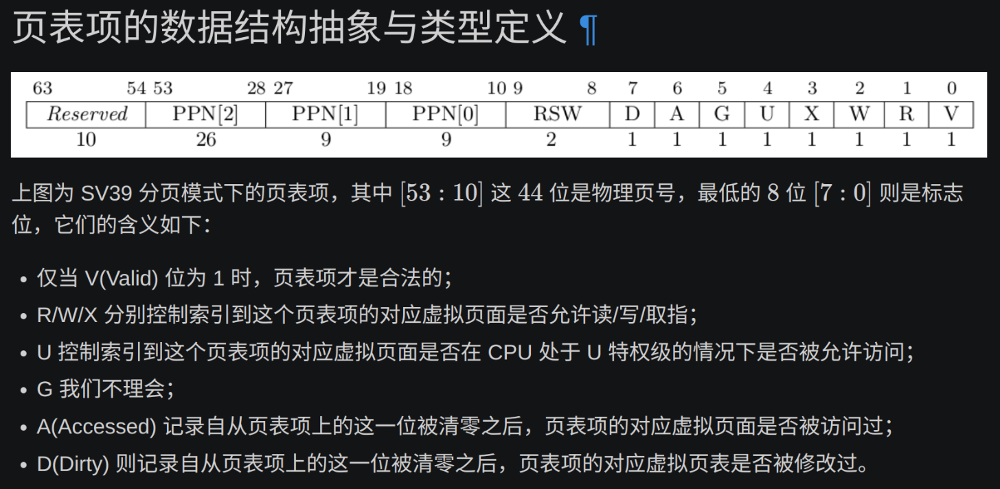

# 实现的功能
sys_get_time模仿的translated_byte_buffer直接写。
sys_trace，用了BTreeMap
unmap和map主要看那个案例理解格式，然后有可能出现sv39不符合的虚拟地址要提前检查，不能直接转，然后找页的那里，我if改了下顺序，虽然作者说调用者保证，但我改了就方便我那个通过。

# 简答题
## 请列举 SV39 页表页表项的组成，描述其中的标志位有何作用？
同指导书。

## 缺页
（原来发送异常的是由mmu等这些硬件发送的？然后和sbi有关吧）
缺页指的是进程访问页面时页面不在页表中或在页表中无效的现象，此时 MMU 将会返回一个中断， 告知 os 进程内存访问出了问题。os 选择填补页表并重新执行异常指令或者杀死进程。
### 请问哪些异常可能是缺页导致的？
缺页有两个常见的原因，其一是 Lazy 策略，也就是直到内存页面被访问才实际进行页表操作。 比如，一个程序被执行时，进程的代码段理论上需要从磁盘加载到内存。但是 os 并不会马上这样做， 而是会保存 .text 段在磁盘的位置信息，在这些代码第一次被执行时才完成从磁盘的加载操作。

缺页的另一个常见原因是 swap 策略，也就是内存页面可能被换到磁盘上了，导致对应页面失效。

### 这样做有哪些好处？（指Lazy 策略）
其实，我们的 mmap 也可以采取 Lazy 策略，比如：一个用户进程先后申请了 10G 的内存空间， 然后用了其中 1M 就直接退出了。按照现在的做法，我们显然亏大了，进行了很多没有意义的页表操作。

就是按需分配

### 发生缺页时，描述相关重要寄存器的值，上次实验描述过的可以简略。
涉及的重要寄存器和ch3差不多，trap.S中出现的那些

### 处理 10G 连续的内存页面，对应的 SV39 页表大致占用多少内存 (估算数量级即可)？
rcore tutorial有分析页表的内存占用，在"分析 SV39 多级页表的内存占用"那部分。
结论为：设某个应用地址空间实际用到的区域总大小为S字节，则地址空间对应的多级页表消耗内存为$ \frac{S}{512}$ 左右。

### 请简单思考如何才能实现 Lazy 策略，缺页时又如何处理？描述合理即可，不需要考虑实现。
发生缺页异常时，检查页面是否合法且未分配，如果是则分配物理页面，然后回到用户态产生缺页的那条指令重新执行。

### 此时页面失效如何表现在页表项(PTE)上？
用SV39页表项的保留字段RSW以标记页面为懒惰分配状态；或者valid位为0但X、W、R不为0，可以用来标记懒惰分配状态；或者在os/的代码中维护懒惰分配段。总之页表项V为0不一定是非法，可能只是懒惰还未分配。

## 双页表与单页表
为了防范侧信道攻击，我们的 os 使用了双页表。但是传统的设计一直是单页表的，也就是说， 用户线程和对应的内核线程共用同一张页表，只不过内核对应的地址只允许在内核态访问。 (备注：这里的单/双的说法仅为自创的通俗说法，并无这个名词概念，详情见 KPTI )

### 在单页表情况下，如何更换页表？
仅在切换进程的时候更换，陷入的时候不会切换了。
### 单页表情况下，如何控制用户态无法访问内核页面？（tips:看看上一题最后一问）
SV39页表项的U位可以控制。
### 单页表有何优势？（回答合理即可）
不用刷新页表了，TLB不至于白缓存了。
### 双页表实现下，何时需要更换页表？假设你写一个单页表操作系统，你会选择何时更换页表（回答合理即可）？
双页表实现，trap进内核态和从内核态返回用户态都需要切换页表。
单页表实现，发生进程切换时才需要切换页表。